# DIAGRAMA UML - DIAGRAMA DE CLASES

## Más Información

- [Ejemplos UML](https://elvex.ugr.es/decsai/java/pdf/3c-relaciones.pdf)
- [PlantUML](https://plantuml.com/)
- [Visual Paradigm](https://blog.visual-paradigm.com/es/what-are-the-six-types-of-relationships-in-uml-class-diagrams/)
- [UPV](https://www.youtube.com/watch?v=JioEGJIlg88&ab_channel=UniversitatPolit%C3%A8cnicadeVal%C3%A8ncia-UPV)
- [UCAM](https://www.youtube.com/watch?v=zvVzW4LzwTc&list=PLZw74zHcqsrbMU00VnVgfCXEaZdA7p73E&index=13&ab_channel=UCAMUniversidadCat%C3%B3licadeMurcia)
- [Bellims](https://www.youtube.com/watch?v=3cXXYgxKUn0&ab_channel=bellims)
- [Big Learning](https://www.youtube.com/watch?v=BmnY7oEN9hQ&list=PLrP8pSZSCRWMFyKg_Wy6Bu0s3sjZt0eRJ&index=13&ab_channel=BigLearning)
- [Lucid](https://www.youtube.com/watch?v=Z0yLerU0g-Q&ab_channel=LucidSoftwareEspa%C3%B1ol)
- [LucidChart](https://www.lucidchart.com/pages/es/tutorial-de-diagrama-de-clases-uml?utm_campaign=uml_class_es&utm_medium=video&utm_source=youtube#discoveryTop)
- [Asociacion vs composicion vs Agregacion](https://www.educative.io/answers/association-vs-composition-vs-aggregation)

## Atributos y Métodos

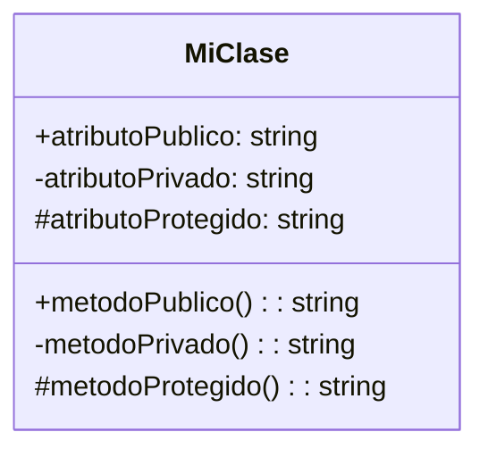
```mermaid
classDiagram
    class MiClase {
        +atributoPublico: string
        -atributoPrivado: string
        #atributoProtegido: string
        +metodoPublico(): string
        -metodoPrivado(): string
        #metodoProtegido(): string
    }
```

## FLECHAS

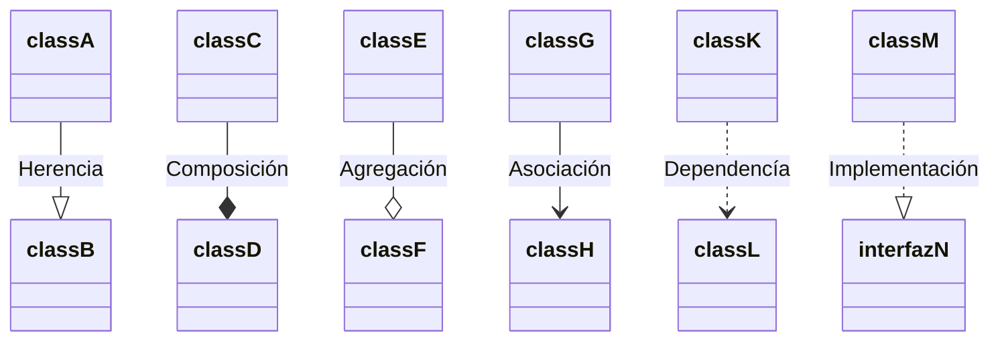
```mermaid
classDiagram
classA --|> classB : Herencia
classC --* classD : Composición
classE --o classF : Agregación
classG --> classH : Asociación
classK ..> classL : Dependencía
classM ..|> interfazN : Implementación
```

- **ES** (semántica = Definición)
  - **Herencia**: es otra clase más genérica, y por tanto hereda atributos y métodos genéricos.
  - **Implementación**: implementa métodos de una interfaz.
- **TIENE** (estructural = Atributos) **Cardinalidad**
  - **Asociación**: tiene referencia a objetos creados <u>externamente</u> (ciclos de vidas independientes). Una relación entre iguales.
    - **Agregación**: tiene referencia a objetos creados <u>externamente</u> (ciclos de vidas independientes). Una relación entre el "todo" y las "partes". La clase contenedora (dueña) tiene a la contenida.
  - **Composición** tiene objetos creados <u>internamente</u>(comparten ciclo de vida). Una relación entre la clase contenedora y contenida (el todo y las partes).
- **USA**
  - **Dependencia**: Una clase usa métodos/atributos de otra clase, pero no guarda su referencia. Normalmente la recibe como argumento.

## HERENCIA

### Ejemplo 1

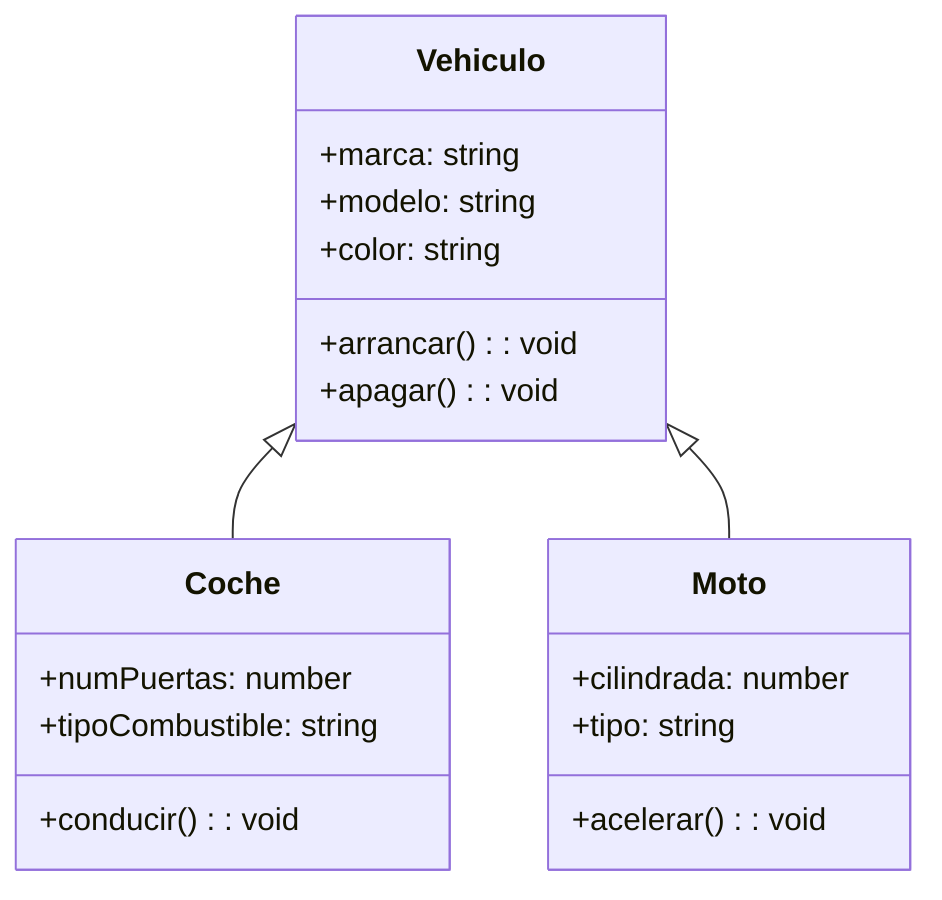
```mermaid
classDiagram
    class Vehiculo {
        +marca: string
        +modelo: string
        +color: string
        +arrancar(): void
        +apagar(): void
    }

    class Coche {
        +numPuertas: number
        +tipoCombustible: string
        +conducir(): void
    }

    class Moto {
        +cilindrada: number
        +tipo: string
        +acelerar(): void
    }

    Vehiculo <|-- Coche
    Vehiculo <|-- Moto
```

### Ejemplo 2

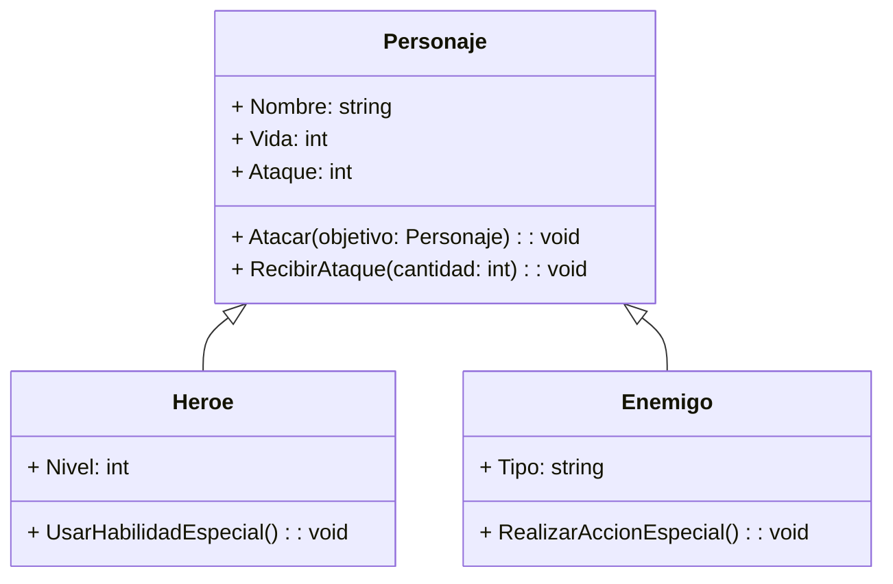
```mermaid
classDiagram
    class Personaje {
        + Nombre: string
        + Vida: int
        + Ataque: int
        + Atacar(objetivo: Personaje): void
        + RecibirAtaque(cantidad: int): void
    }

    class Heroe {
        + Nivel: int
        + UsarHabilidadEspecial(): void
    }

    class Enemigo {
        + Tipo: string
        + RealizarAccionEspecial(): void
    }

    Personaje <|-- Heroe
    Personaje <|-- Enemigo
```

## IMPLEMENTACIÓN

### Ejemplo 1

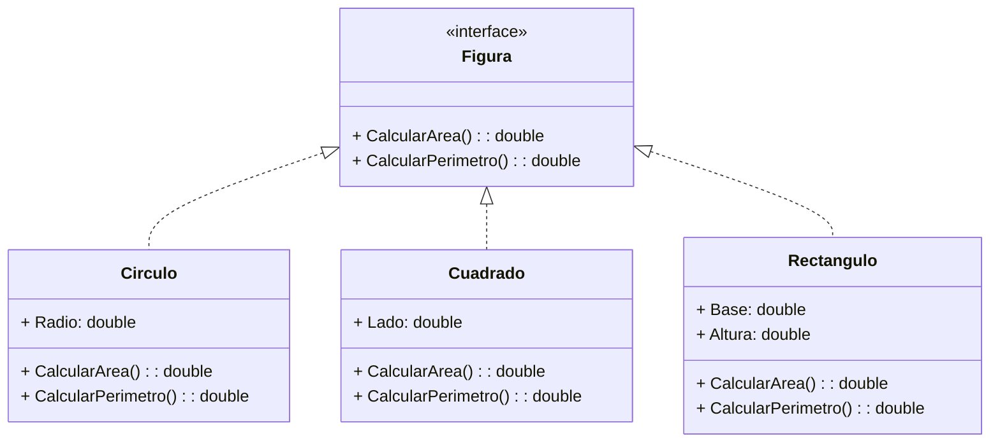
```mermaid
classDiagram
    class Figura {
        <<interface>>
        + CalcularArea(): double
        + CalcularPerimetro(): double
    }

    class Circulo {
        + Radio: double
        + CalcularArea(): double
        + CalcularPerimetro(): double
    }

    class Cuadrado {
        + Lado: double
        + CalcularArea(): double
        + CalcularPerimetro(): double
    }

    class Rectangulo {
        + Base: double
        + Altura: double
        + CalcularArea(): double
        + CalcularPerimetro(): double
    }

    Figura <|.. Circulo
    Figura <|.. Cuadrado
    Figura <|.. Rectangulo

```

### Ejemplo 2

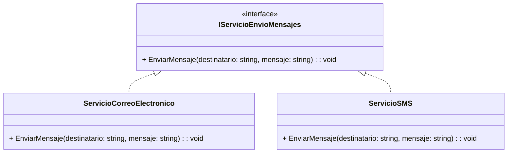
```mermaid
classDiagram
    class IServicioEnvioMensajes {
        <<interface>>
        + EnviarMensaje(destinatario: string, mensaje: string): void
    }

    class ServicioCorreoElectronico {
        + EnviarMensaje(destinatario: string, mensaje: string): void
    }

    class ServicioSMS {
        + EnviarMensaje(destinatario: string, mensaje: string): void
    }

    IServicioEnvioMensajes <|.. ServicioCorreoElectronico
    IServicioEnvioMensajes <|.. ServicioSMS

```

## ASOCIACIÓN

### Ejemplo 1

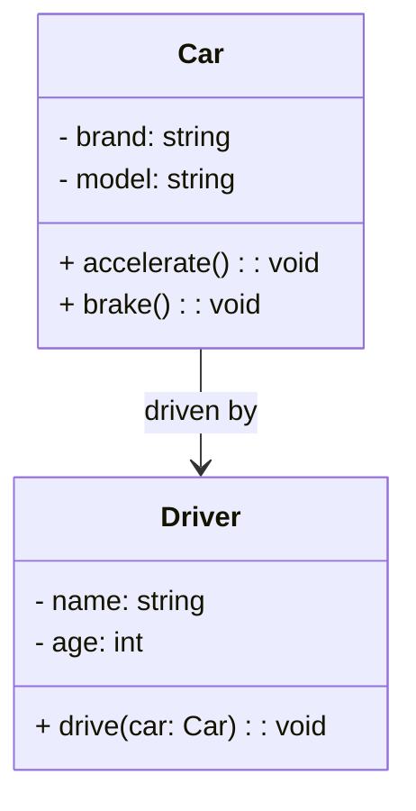
```mermaid
classDiagram
    class Car {
        - brand: string
        - model: string
        + accelerate(): void
        + brake(): void
    }

    class Driver {
        - name: string
        - age: int
        + drive(car: Car): void
    }

    Car --> Driver : driven by
```

### Ejemplo 2

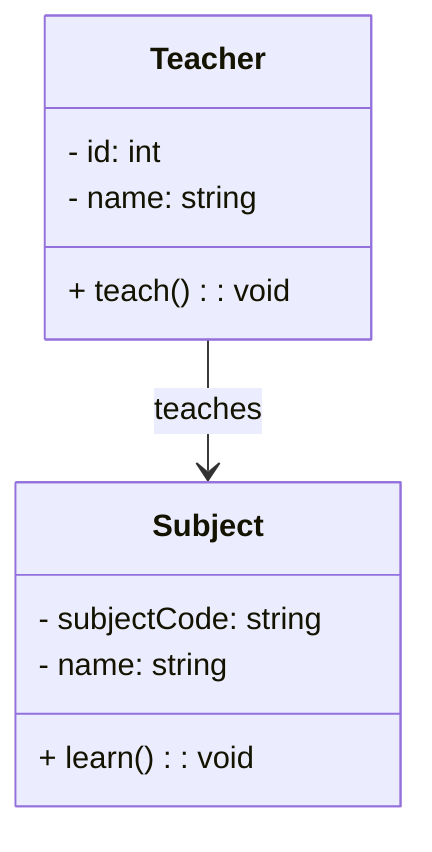
```mermaid
classDiagram
    class Teacher {
        - id: int
        - name: string
        + teach(): void
    }

    class Subject {
        - subjectCode: string
        - name: string
        + learn(): void
    }

    Teacher --> Subject : teaches
```

## AGREGACIÓN

### Ejemplo 1
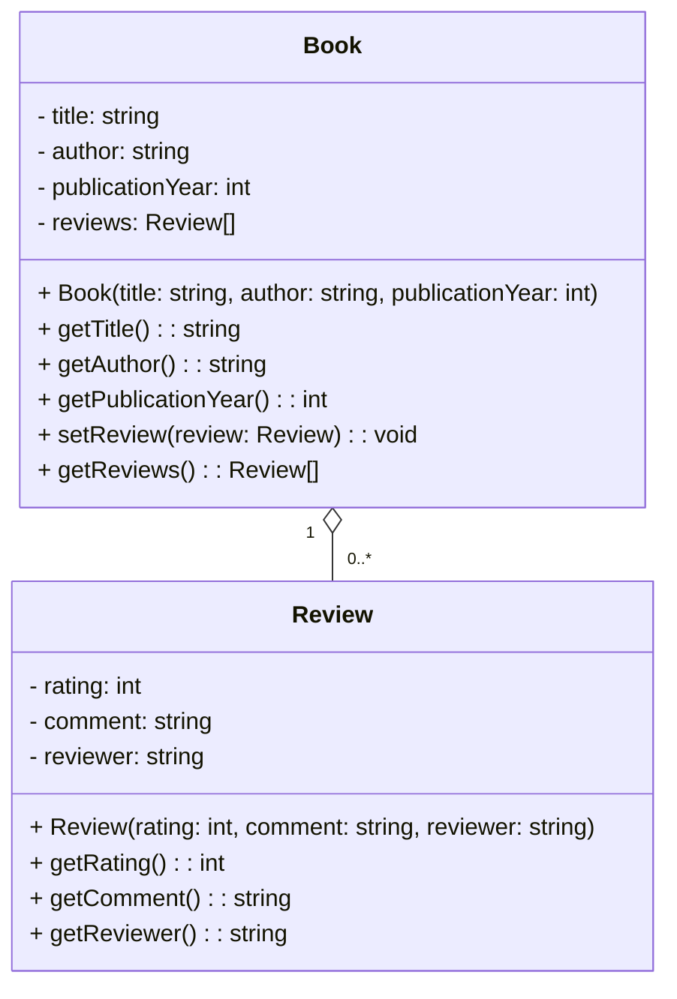
```mermaid
classDiagram
    class Book {
        - title: string
        - author: string
        - publicationYear: int
        - reviews: Review[]
        + Book(title: string, author: string, publicationYear: int)
        + getTitle(): string
        + getAuthor(): string
        + getPublicationYear(): int
        + setReview(review: Review): void
        + getReviews(): Review[]
    }

    class Review {
        - rating: int
        - comment: string
        - reviewer: string
        + Review(rating: int, comment: string, reviewer: string)
        + getRating(): int
        + getComment(): string
        + getReviewer(): string
    }

    Book "1" o-- "0..*" Review

```

### Ejemplo 2

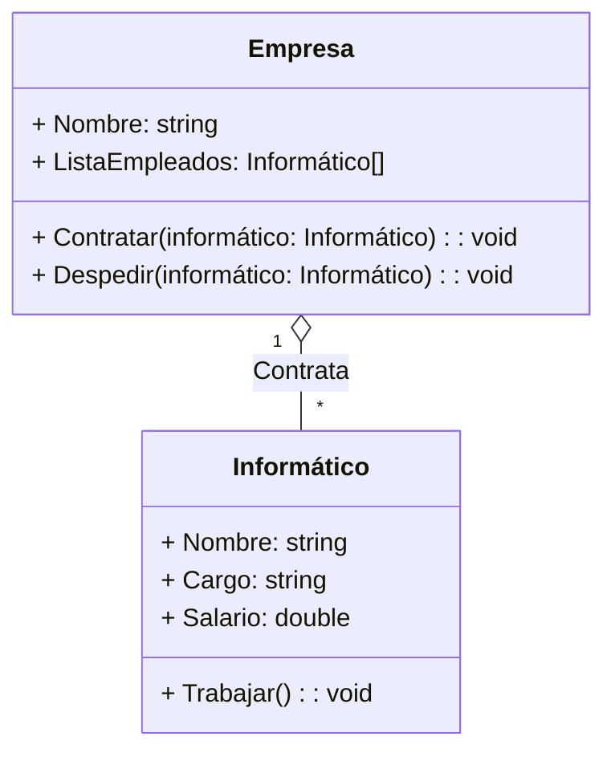
```mermaid
classDiagram
    class Empresa {
        + Nombre: string
        + ListaEmpleados: Informático[]
        + Contratar(informático: Informático): void
        + Despedir(informático: Informático): void
    }

    class Informático {
        + Nombre: string
        + Cargo: string
        + Salario: double
        + Trabajar(): void
    }

    Empresa "1" o-- "*" Informático : Contrata

```

### Ejemplo 3

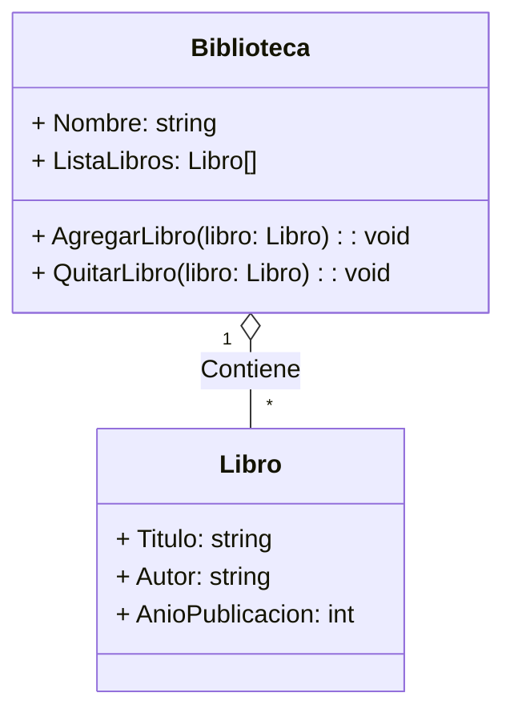
```mermaid
classDiagram
    class Biblioteca {
        + Nombre: string
        + ListaLibros: Libro[]
        + AgregarLibro(libro: Libro): void
        + QuitarLibro(libro: Libro): void
    }

    class Libro {
        + Titulo: string
        + Autor: string
        + AnioPublicacion: int
    }

    Biblioteca "1" o-- "*" Libro : Contiene
```

## COMPOSICIÓN

### Ejemplo 1

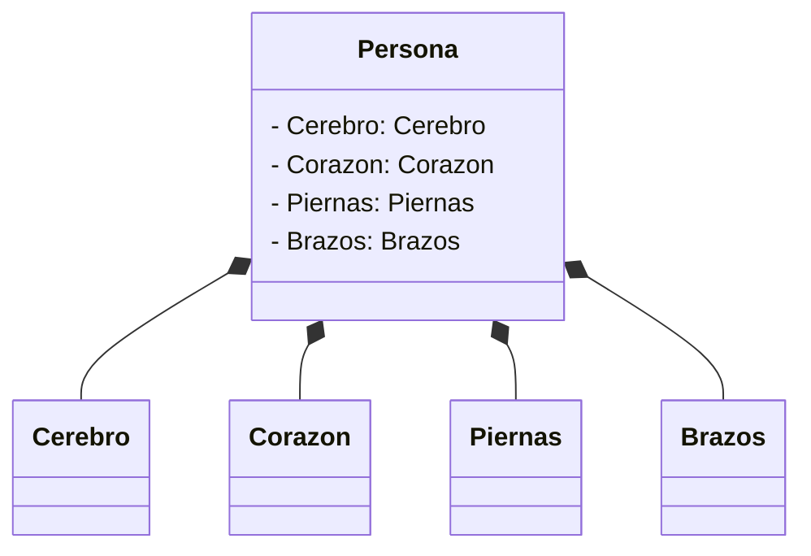
```mermaid
classDiagram
    class Persona {
        - Cerebro: Cerebro
        - Corazon: Corazon
        - Piernas: Piernas
        - Brazos: Brazos
    }

    class Cerebro
    class Corazon
    class Piernas
    class Brazos

    Persona *-- Cerebro
    Persona *-- Corazon
    Persona *-- Piernas
    Persona *-- Brazos

```

### Ejemplo 2

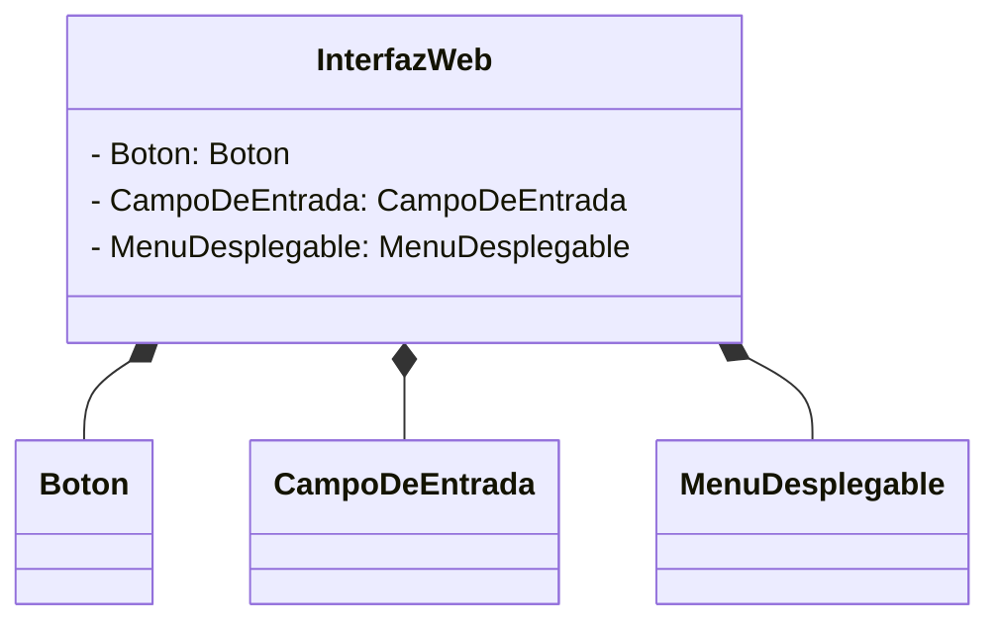
```mermaid
classDiagram
    class InterfazWeb {
        - Boton: Boton
        - CampoDeEntrada: CampoDeEntrada
        - MenuDesplegable: MenuDesplegable
    }

    class Boton
    class CampoDeEntrada
    class MenuDesplegable

    InterfazWeb *-- Boton
    InterfazWeb *-- CampoDeEntrada
    InterfazWeb *-- MenuDesplegable

```

## DEPENDENCIA

### Ejemplo 1

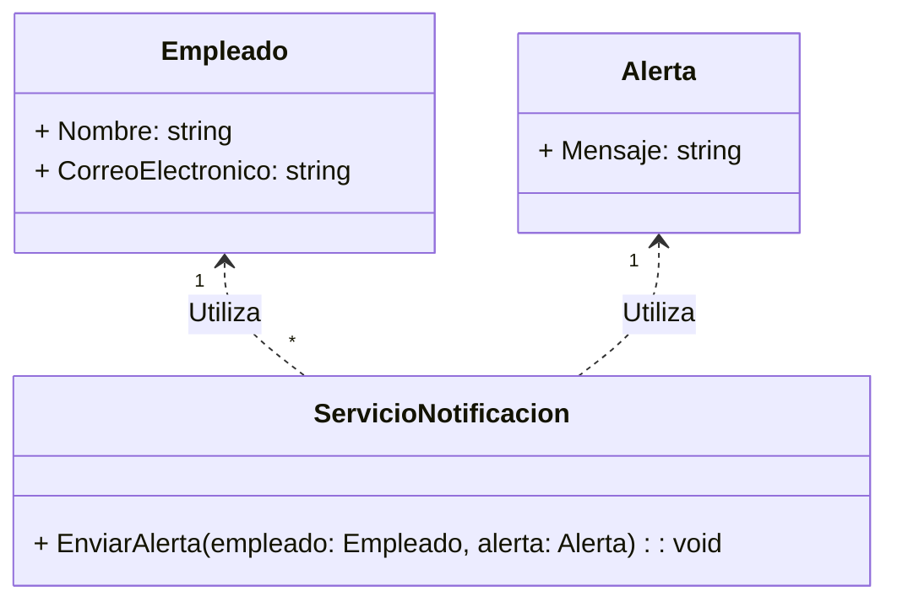
```mermaid
classDiagram
    class Empleado {
        + Nombre: string
        + CorreoElectronico: string
    }

    class Alerta {
        + Mensaje: string
    }

    class ServicioNotificacion {
        + EnviarAlerta(empleado: Empleado, alerta: Alerta): void
    }

    Empleado "1" <.. "*" ServicioNotificacion: Utiliza
    Alerta "1" <.. "*" ServicioNotificacion: Utiliza
```

### Ejemplo 2

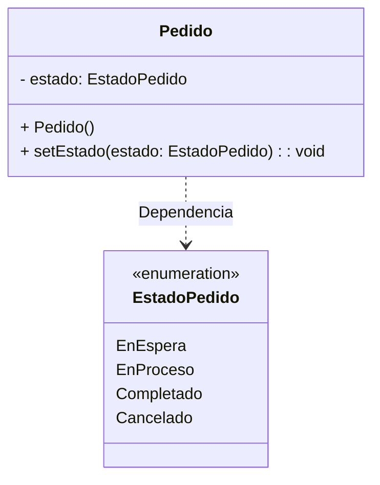
```mermaid
classDiagram
    class Pedido {
        - estado: EstadoPedido
        + Pedido()
        + setEstado(estado: EstadoPedido): void
    }

    class EstadoPedido {
        <<enumeration>>
        EnEspera
        EnProceso
        Completado
        Cancelado
    }

    Pedido ..> EstadoPedido: Dependencia
```

### Ejemplo 3

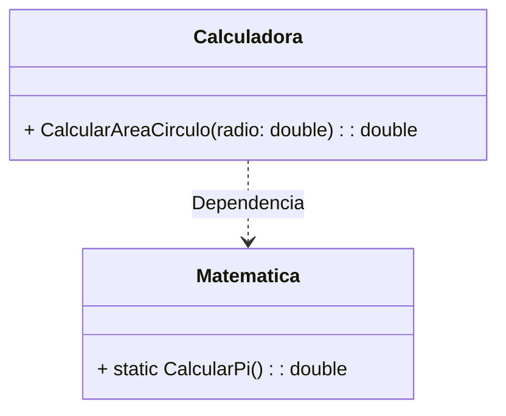
```mermaid
classDiagram
    class Calculadora {
        + CalcularAreaCirculo(radio: double): double
    }

    class Matematica {
        + static CalcularPi(): double
    }

    Calculadora ..> Matematica: Dependencia
```

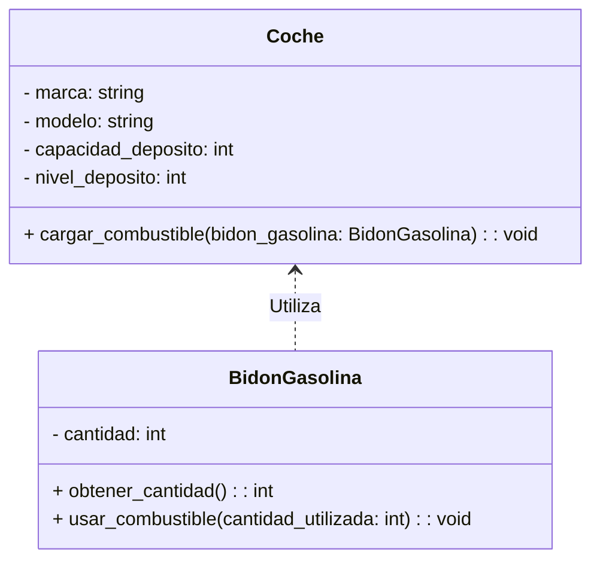
```mermaid
classDiagram
    class Coche {
        - marca: string
        - modelo: string
        - capacidad_deposito: int
        - nivel_deposito: int
        + cargar_combustible(bidon_gasolina: BidonGasolina): void
    }

    class BidonGasolina {
        - cantidad: int
        + obtener_cantidad(): int
        + usar_combustible(cantidad_utilizada: int): void
    }

    Coche <.. BidonGasolina : Utiliza
```

---

## OTROS EJEMPLOS

### Empresa, informáticos y proyectos

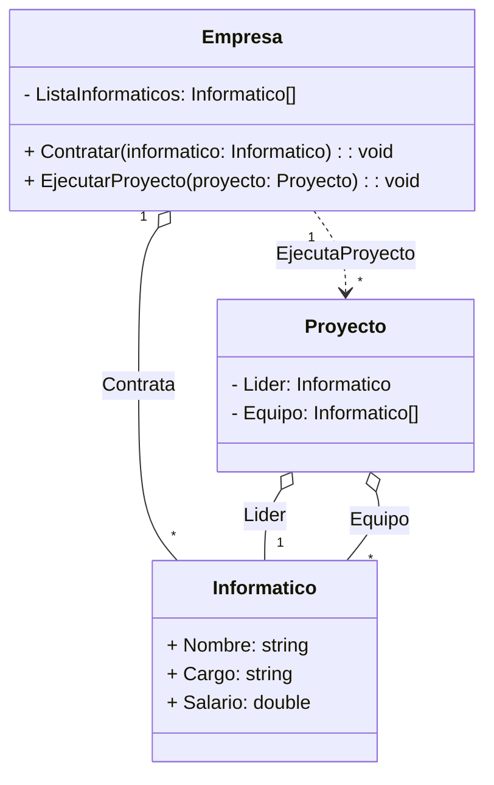
```mermaid
classDiagram
    class Empresa {
        - ListaInformaticos: Informatico[]
        + Contratar(informatico: Informatico): void
        + EjecutarProyecto(proyecto: Proyecto): void
    }

    class Informatico {
        + Nombre: string
        + Cargo: string
        + Salario: double
    }

    class Proyecto {
        - Lider: Informatico
        - Equipo: Informatico[]
    }

    Empresa "1" o-- "*" Informatico : Contrata
    Empresa "1" ..> "*" Proyecto : EjecutaProyecto
    Proyecto o-- "1" Informatico : Lider
    Proyecto o-- "*" Informatico : Equipo
```

### Service, Repository

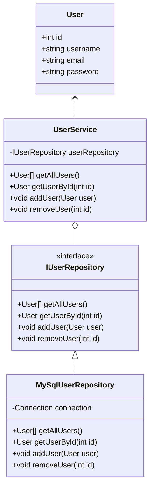
```mermaid
classDiagram
    class User {
        +int id
        +string username
        +string email
        +string password
    }
    class IUserRepository {
        <<interface>>
        +User[] getAllUsers()
        +User getUserById(int id)
        +void addUser(User user)
        +void removeUser(int id)
    }
    class MySqlUserRepository {
        -Connection connection
        +User[] getAllUsers()
        +User getUserById(int id)
        +void addUser(User user)
        +void removeUser(int id)
    }
    class UserService {
        -IUserRepository userRepository
        +User[] getAllUsers()
        +User getUserById(int id)
        +void addUser(User user)
        +void removeUser(int id)
    }

    User <.. UserService
    IUserRepository <|.. MySqlUserRepository
    UserService o-- IUserRepository

```

### Ejemplo 3

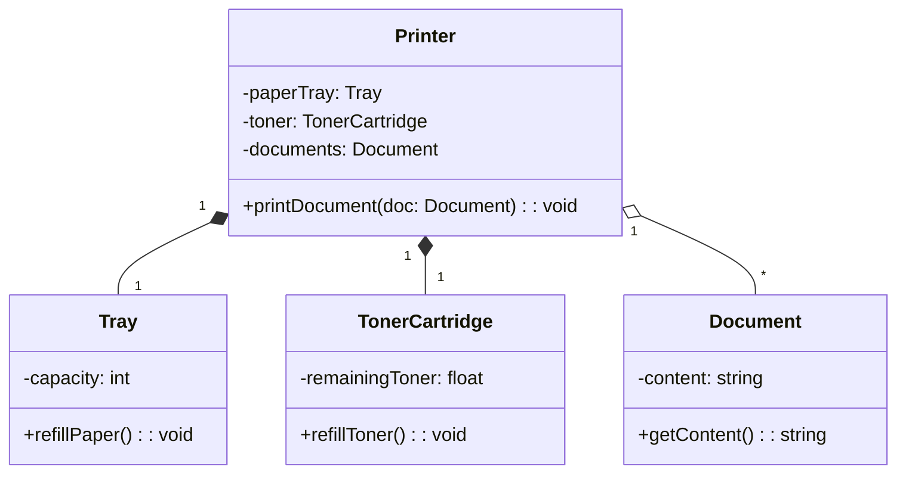
```mermaid
classDiagram
    class Printer {
        -paperTray: Tray
        -toner: TonerCartridge
        -documents: Document
        +printDocument(doc: Document): void
    }
    class Tray {
        -capacity: int
        +refillPaper(): void
    }
    class TonerCartridge {
        -remainingToner: float
        +refillToner(): void
    }
    class Document {
        -content: string
        +getContent(): string
    }

    Printer "1" *-- "1" Tray
    Printer "1" *-- "1" TonerCartridge
    Printer "1" o-- "*" Document
```
